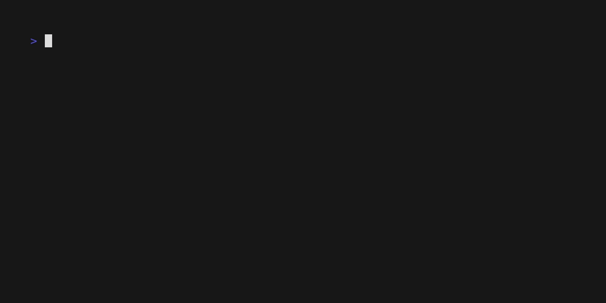

# Panes

A [Bubble Tea](https://github.com/charmbracelet/bubbletea) component for 
creating multi-pane applications.

## Default Keybinds

Use ctrl+h, ctrl+j, ctrl+k and ctrl+l to switch between panes, with only the 
active pane being updated.

## Default Styles

By default, the active pane will have a rounded border.

## Describe your pane layout

To describe a pane layout, use a 2D slice of Models like so:

`go
    p := panes.New(
        [][]tea.Model{
        {yourmodel.New(), yourmodel.New()},
        {yourmodel.New(), yourmodel.New()},
        },
    )
`

## Transitions

To execute a function when focus enters and leaves a pane, implement In and Out
methods on your model like so:

`go
    func (m Model) In() tea.Model {
        m.Focus()
        return m
    }

    func (m Model) Out() tea.Model {
        m.Blur()
        return m
    }
`

